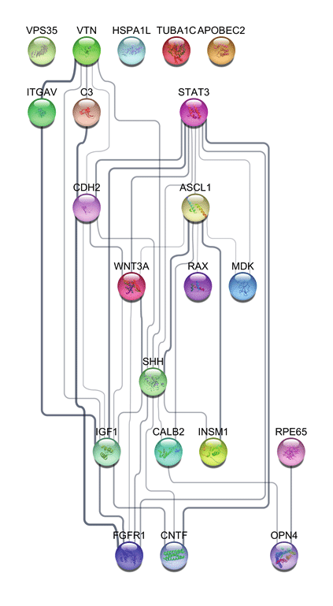
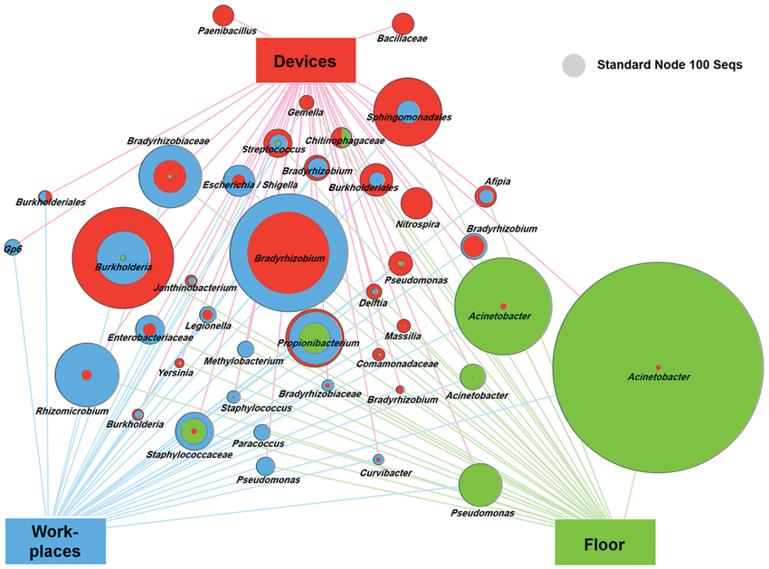
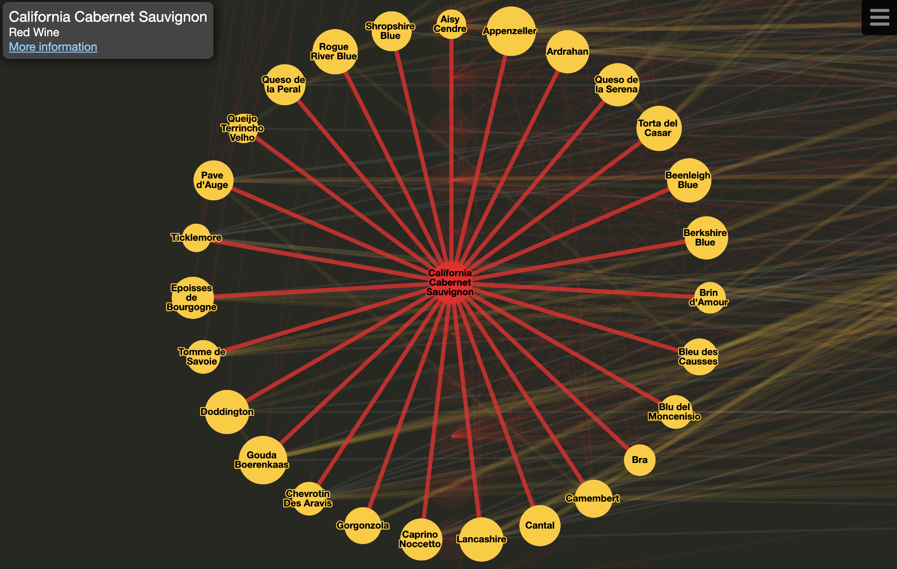
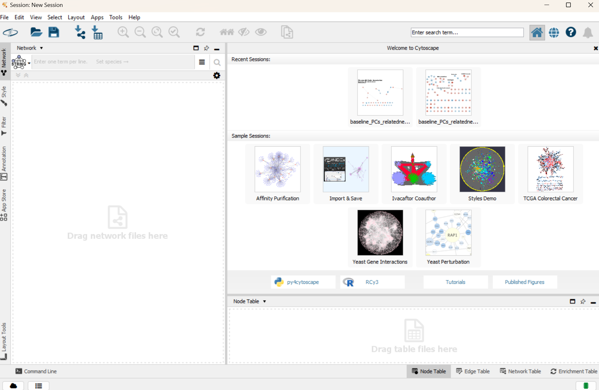

# Cytoscape: Network Biology, topological and pathway analysis, and data visualization  
### Grace Constantian, Michael Brown, and Christy Deliivanov

*   [Introduction](#introduction)
*   [Applications](#applications)
*   [Example](#example)
*   [Sources](#sources)

* * *

## Introduction

### What is Cytoscape?

Cytoscape was created in 2002 by a group of researchers including Paul Shannon, Andrew Markiel, Owen Ozier, Nitin S. Baliga, Jonathan T. Wang, Daniel Ramage, Nada Amin, Benno Schwikowski, and Trey Ideker as a tool for network biology research. Now while it is still used as a vital tool for network biology research it has broader applications to include fields such as social science, systems biology, and computational chemistry. As of 2023, Cytoscape has grown in popularity with about 20,000 downloads per month. The Cytoscape website refers to itself as 'an open source software platform for visualizing molecular interaction networks and biological pathways and integrating these networks with annotations, gene expression profiles and other state data'(https://cytoscape.org/). 

Cytoscape's architecture includes a core and additional apps you can plug in for enhanced data integration, analysis, and visualization. Cytoscape core gives the user basic functionality to layout and query their data and to visually integrate the network with state data. For more complex projects plugins might be required to analyze and visualize data.

Cytoscape is a non-profit, open source project that is sponsored on public and private grants. Whenever using Cytoscape for a project it is important to cite the original paper. To access the paper click this link: (https://genome.cshlp.org/content/13/11/2498.full.pdf+html)

The current maintenance and development of Cytoscape is being funded by the U.S. National Human Genome Research Intitute (NHGRI).

### What are the different apps in Cytoscape?

Apps (formerly called Plugins) are additional features you can add to your Cytoscape core that can be found on the Cytoscape website. These apps can be created by anyone and the creators of Cytoscape encourage people to develop apps. 

To install an app follow the steps below:

1. Go to the Cytoscape App Store and find the app you want: https://apps.cytoscape.org/
2. Open Cytoscape on your computer and go to the menu bar, choose Apps -> App Manager
3. Select the Install Apps tab and in the Download Site box type in "http://apps.cytoscape.org/"
4. In the search box type in the name of the app you would like to download
5. Click the Install button to install the app

You can also uninstall apps or temporarily disable apps as well. To do this go to the 'Currently Installed' tab in the app manager to find the app and then select uninstall or disable depending on your need. 

The Top 6 Apps on Cytoscape are:

1. ClueGo - Creates and Visualizes the non-redundant terms for large clusters of genes in a functinoally grouped network. Performs single cluster analysis and comparison of multiple clusters.
2. StringApp - Imports functional associations or physical interactions between protein-chemical and protein-protein pairs from a variety of sources. Users can provide a list of genes, proteins, compounds, diseases, species etc and the app queries the database to return a matching network.
3. MCODE - Clusters a network based on topology to find highly interconnected regions.
4. yFiles Layout Algorithms - Connects layout algorithms from the yFiles diagramming libraries to your Cytoscape.
5. CluePedia - Search tool for new markers that are potentially associated to a variety of pathways. CluePedia calculates both linear and non-linear statistical dependencies from data. CluePedia depends on the ClueGo app, so make sure both are installed.
6. BiNGO - Calculates overrepresented Gene Ontology categories in a set of genes and displays them as a network of significant Gene Ontology terms.

### What is Network Biology?

Cytoscape is especially useful within the field of Network Biology. Network biology takes the extra step beyond single gene and pathway analysis to attempting to detect and ultimately model the complex multidimensional interactions of cells, organs, and organisms. In Network Biology graphs are created with the nodes representing the cell, organ, organisms etc and the edge representing the interaction between two nodes. A well known example of Network Biology is a food web where the nodes represent the animal and the directed edges represent a consumer-producer relationship. Cytoscape is primarily used within the field of Network Biology to represent the interactions between genes, proteins, and biochemicals.
* * *

## Applications
### Visualization
Cytoscape is an incredibly versatile tool that can be adjusted to many applications because of its variety of features. 

Cytoscape visualizes networks in two dimensions with a variety of layouts. There are both discrete and continuous layouts. The ‘grid’ layout is the current default with a structured and uniform view. The preset layout allows you to place each node for full customization. There are also a variety of geometric layouts such as circle, concentric, and avsdf (which arranges nodes to avoid edge overlap). There are also a variety of hierarchical and force-directed layouts.  

Nodes and edges are easily customized and stylized to reflect specific datasets best. One can use animations to show change over time or over different conditions. 

### Handling Data
Cytoscape can support data from many different standard network and annotation file types including SIF, GML, XGMML, BioPAX, PSI-MI, GraphML, KGML (KEGG XML), SBML, OBO, and Gene Association. You can also use data files generated by other applications or spreadsheet software. This can be useful for customizing data visualization by creating custom annotation terms, confidence values, and more. 

Cytoscape can draw network and annotation data from external public databases.  Pathway Commons, IntAct, BioMart, and NCBI Entrez Gene are supported. 

Apps can be used to perform specialized tasks. Cytoscape software is Java-based, which means users can create customized ‘Apps’ for any specific data analysis, import, or visualization. There are also many apps already available in the ‘App Manager’ for network and molecular profile analysis. For example, the stringApp imports and augments Cytoscape networks from STRING.   

### Fields
Cytoscape helps visualize data for many different biological fields. Its features are easily adjusted and can even apply to data in non-biological contexts.

In systems biology, one can display molecular interaction networks, biological pathways, and gene expression. A common example is the PPI, or protein protein interaction map. This image shows a hierarchical layout done by stringApp representing a GO analysis of retina regeneration effective growth. 
	

With epidemiology, disease transmission and contact tracing can be visualized. This image represents the presence of different bacteria in different locations within an ICU. We can see how the circular nodes represent different OTUs and are placed in reference to the three location nodes, as well as color coded to show their location prevalence. The size of the nodes also represent their mean relative abundance.
	
Within ecology, one can visualize ecosystems, food webs, and resource flow. The hierarchical layout is a great feature for arranging species based on trophic levels for these examples. 

With neuroscience, one can display neural networks. The force-directed layouts are perfect for displaying highly connected neurons while avoiding edge overlap, making for readable and intuitive graphs.

Cytoscape can also be adjusted to display data for non-biological fields. For example, with sociology, we can display group interactions and relationships. 

### Wine and Cheese

An intriguing example of a map is this [wine and cheese map](http://www.wineandcheesemap.com/). The red nodes represent red wines, the white nodes represent white wines, and the yellow nodes represent cheese types. 

So the map shows all the different connections, or pairings, that go well together. It is also interactive, zooming in to feature all the connections when you pick a node of interest. It also displays more information on the node and provides a link to more information. This map is a testament to the variety of data that can be visualized with Cytoscape.

* * *

## Example - Proteomic data with StringApp
## Layout
Priamrily, the Cytoscape layout is separated into three distinct panels

1. Vertical panel on the left side of the platform is where each network populates and provides the user with the number of nodes and edges respectively, along with network management features   
2. Top right-central panel is where the network/cluster visualization populates after a network is selected from the previous panel
3. Bottom right-horizontal panel contain all tabular data associated with your current session, including things like functional enrichment results

* * *

## Sources

- https://github.com/cytoscape/cytoscape-tutorials/wiki#presentations-1
- https://genome.cshlp.org/content/13/11/2498.full#aff-3
- https://blog.js.cytoscape.org/2020/05/11/layouts/
- https://manual.cytoscape.org/en/latest/Introduction.html
- Shannon P, Markiel A, Ozier O, Baliga NS, Wang JT, Ramage D, Amin N, Schwikowski B, Ideker T. Cytoscape: a software environment for integrated models of biomolecular interaction networks. Genome Res. 2003 Nov;13(11):2498-504. doi: 10.1101/gr.1239303. PMID: 14597658; PMCID: PMC403769.
- Sporta Caputi, S., Kabala, J.P., Rossi, L. et al. Individual diet variability shapes the architecture of Antarctic benthic food webs. Sci Rep 14, 12333 (2024). https://doi.org/10.1038/s41598-024-62644-5

*
